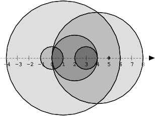

# Exercise Name

## Credits

<https://app.codility.com/programmers/lessons>

## Introduction

We draw N discs on a plane. The discs are numbered from 0 to N − 1. An array A of N non-negative integers, specifying the radiuses of the discs, is given. The J-th disc is drawn with its center at (J, 0) and radius A[J].

We say that the J-th disc and K-th disc intersect if J ≠ K and the J-th and K-th discs have at least one common point (assuming that the discs contain their borders).

The figure below shows discs drawn for N = 6 and A as follows:

  A[0] = 1
  A[1] = 5
  A[2] = 2
  A[3] = 1
  A[4] = 4
  A[5] = 0

There are eleven (unordered) pairs of discs that intersect, namely:

discs 1 and 4 intersect, and both intersect with all the other discs;
disc 2 also intersects with discs 0 and 3.
Write a function:

function solution(A);

that, given an array A describing N discs as explained above, returns the number of (unordered) pairs of intersecting discs. The function should return −1 if the number of intersecting pairs exceeds 10,000,000.

Given array A shown above, the function should return 11, as explained above.

Write an efficient algorithm for the following assumptions:

N is an integer within the range [0..100,000];
each element of array A is an integer within the range [0..2,147,483,647].

## Time Limit

- 120 minutes

## Test inputs

- [1, 5, 2, 1, 4, 0] => 11
